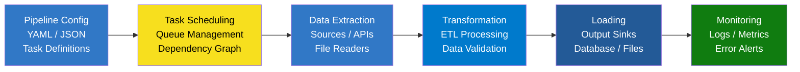

# Data-Pipeline-Orchestrator-TS

<div align="center">


</div>


## English

### 🚀 Overview
Advanced data pipeline orchestration platform with workflow management and monitoring

This project demonstrates professional TypeScript development skills with modern best practices, clean code architecture, and industry-standard implementations.



### 🛠️ Technology Stack
TypeScript, data pipelines, ETL, workflow orchestration, data engineering

### ⚡ Features
- Professional code architecture
- Modern development practices
- Comprehensive error handling
- Performance optimized
- Well-documented codebase
- Industry-standard patterns

### 🏃‍♂️ Quick Start

```bash
# Clone the repository
git clone https://github.com/galafis/Data-Pipeline-Orchestrator-TS.git

# Navigate to project directory
cd Data-Pipeline-Orchestrator-TS

# Follow language-specific setup instructions below
```

### 📦 Installation & Setup

```bash
# Install dependencies
npm install

# Build the project
npm run build

# Run the application
npm start
```

### 🎯 Use Cases
- Professional development portfolio
- Learning modern TypeScript practices
- Code reference and examples
- Enterprise-grade implementations

### 📊 Project Structure
```
Data-Pipeline-Orchestrator-TS/
├── README.md
├── LICENSE
├── main.ts
├── package.json
├── tsconfig.json
├── dist/
└── src/
```

### 🤝 Contributing
Contributions are welcome! Please feel free to submit a Pull Request.

### 📄 License
This project is licensed under the MIT License - see the LICENSE file for details.

### 👨‍💻 Author
**Gabriel Demetrios Lafis**
- Data Scientist & Engineer
- Systems Developer & Analyst
- Cybersecurity Specialist

---

## Português

### 🚀 Visão Geral
Advanced data pipeline orchestration platform with workflow management and monitoring

Este projeto demonstra habilidades profissionais de desenvolvimento em TypeScript com práticas modernas, arquitetura de código limpo e implementações padrão da indústria.

### 🛠️ Stack Tecnológica
TypeScript, data pipelines, ETL, workflow orchestration, data engineering

### ⚡ Funcionalidades
- Arquitetura de código profissional
- Práticas modernas de desenvolvimento
- Tratamento abrangente de erros
- Otimizado para performance
- Base de código bem documentada
- Padrões da indústria

### 🏃‍♂️ Início Rápido

```bash
# Clone o repositório
git clone https://github.com/galafis/Data-Pipeline-Orchestrator-TS.git

# Navegue para o diretório do projeto
cd Data-Pipeline-Orchestrator-TS

# Siga as instruções de configuração específicas da linguagem abaixo
```

### 📦 Instalação e Configuração

```bash
# Instale as dependências
npm install

# Construa o projeto
npm run build

# Execute a aplicação
npm start
```

### 🎯 Casos de Uso
- Portfólio de desenvolvimento profissional
- Aprendizado de práticas modernas em TypeScript
- Referência de código e exemplos
- Implementações de nível empresarial

### 🤝 Contribuindo
Contribuições são bem-vindas! Sinta-se à vontade para enviar um Pull Request.

### 📄 Licença
Este projeto está licenciado sob a Licença MIT - veja o arquivo LICENSE para detalhes.

### 👨‍💻 Autor
**Gabriel Demetrios Lafis**
- Cientista e Engenheiro de Dados
- Desenvolvedor e Analista de Sistemas
- Especialista em Segurança Cibernética

---

⭐ **Se este projeto foi útil para você, considere dar uma estrela!**
