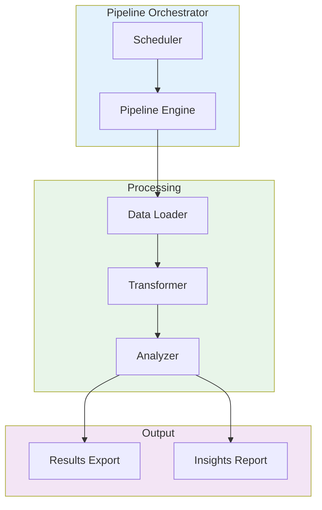

# Data Pipeline Orchestrator


[English](#english) | [Portugues (BR)](#portugues-br)

---

## English

### Overview

Data Pipeline Orchestrator built with TypeScript for scheduling, executing, and monitoring ETL workflows. Supports configurable batch processing, retry logic, and statistical analysis across multiple data sources with built-in insight generation and recommendation engines.

### Architecture


```mermaid
graph TB
    subgraph Orchestrator["Pipeline Orchestrator"]
        A[Scheduler]
        B[Pipeline Engine]
    end
    subgraph Processing["Processing"]
        C[Data Loader]
        D[Transformer]
        E[Analyzer]
    end
    subgraph Output["Output"]
        F[Results Export]
        G[Insights Report]
    end
    A --> B --> C --> D --> E
    E --> F
    E --> G
    style Orchestrator fill:#e3f2fd
    style Processing fill:#e8f5e9
    style Output fill:#f3e5f5
```

### Key Features

- **Pipeline Orchestration** -- Schedule and manage multi-stage data processing workflows
- **Batch Processing** -- Configurable batch sizes for large-scale data ingestion
- **Statistical Analysis** -- Real-time summary statistics and anomaly detection
- **Insight Generation** -- Automated pattern recognition and actionable recommendations
- **Retry Logic** -- Configurable retry attempts with exponential backoff
- **Data Export** -- Structured output with metadata for downstream consumption

### Industry Application

This orchestrator addresses data engineering challenges in enterprise ETL systems, real-time analytics platforms, and data lake architectures. The pipeline management patterns are used in financial data processing, IoT telemetry aggregation, and healthcare data integration workflows.

### Tech Stack

| Technology | Purpose |
|------------|---------|
| **TypeScript 5.0+** | Type-safe pipeline logic |
| **Node.js 20+** | Runtime environment |
| **Docker** | Containerized deployment |

### Quick Start

```bash
git clone https://github.com/galafis/Data-Pipeline-Orchestrator-TS.git
cd Data-Pipeline-Orchestrator-TS
npm install
npm run dev
```

### Docker

```bash
docker build -t data-pipeline-orchestrator .
docker run -p 3000:3000 --env-file .env data-pipeline-orchestrator
```

### Testing

```bash
npm test
```

### License

This project is licensed under the MIT License - see the [LICENSE](LICENSE) file for details.

### Author

**Gabriel Demetrios Lafis**
- GitHub: [@galafis](https://github.com/galafis)
- LinkedIn: [Gabriel Demetrios Lafis](https://linkedin.com/in/gabriel-demetrios-lafis)

---

## Portugues (BR)

### Visao Geral

Orquestrador de Pipeline de Dados construido com TypeScript para agendamento, execucao e monitoramento de workflows ETL. Suporta processamento em lote configuravel, logica de retentativa e analise estatistica em multiplas fontes de dados com geracao de insights e motores de recomendacao integrados.

### Principais Funcionalidades

- **Orquestracao de Pipelines** -- Agendar e gerenciar workflows de processamento de dados multi-estagio
- **Processamento em Lote** -- Tamanhos de lote configuraveis para ingestao de dados em larga escala
- **Analise Estatistica** -- Estatisticas resumidas em tempo real e deteccao de anomalias
- **Geracao de Insights** -- Reconhecimento automatico de padroes e recomendacoes acionaveis

### Inicio Rapido

```bash
git clone https://github.com/galafis/Data-Pipeline-Orchestrator-TS.git
cd Data-Pipeline-Orchestrator-TS
npm install
npm run dev
```

### Licenca

Este projeto esta licenciado sob a Licenca MIT - veja o arquivo [LICENSE](LICENSE) para detalhes.

### Autor

**Gabriel Demetrios Lafis**
- GitHub: [@galafis](https://github.com/galafis)
- LinkedIn: [Gabriel Demetrios Lafis](https://linkedin.com/in/gabriel-demetrios-lafis)
